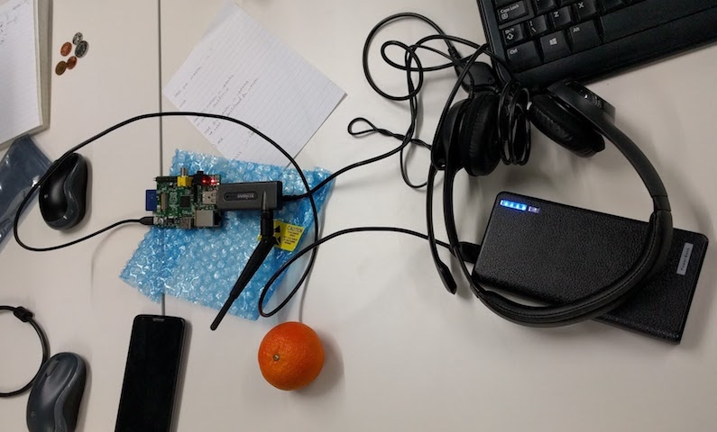

# PyPong
Collaboration project for Nexmo IOT Hackathon, 2016

This idea was envisioned by Anton, driven by his genuine love and passion for ping pong. Being surrounded by so many ping pong stars in Nexmo makes it really hard to find the ping pong table available.
So this is when the inspiration came! The team decided to create a smart ping pong table that would allow all the prospect players to be notified whether the ping pong table is being used by other people or it's free to be used. But we have realized that the technology we were building and dreaming about has the potential to disrupt the Ping Pong sport for ever.

The whole project is based upon statistics that would derive from the calculations made upon the number of bounces on the ping pong table and the levels of sound detected by a sensor. And the dynamics of such a software could transform the traditional ping pong game into a digital experience through which the player will have access to very useful data. We've imagine a certain number of applications that can use this technology to disrupt the sport.

We used Raspberry Pi with a microphone attached to the ping pong table to record ping pong ball bounces. Processed and analysed audio streams in real time to measure amplitude and length of each bounce. The data was used to display how many bounces were made in each streak and longevity of the game. The longest game streak, total streaks and the table availability are displayed on the dashboard. Table status is shown as reserved when a game is currently being played, but there is an option to get a notification when the table becomes available by sending an SMS to the number.

## Set Up
* Orange RPi
* USB Headset (used for microphone, but only usb mic will do)
* 10,000 mhz power bank
* WIFI dongle

Our set up looked like this:




## Installation
First, start MySQL server locally
```
virtualenv venv
source venv/bin/activate
pip install -r requirements.txt
export FLASK_APP=app
export FLASK_DEBUG=true
flask run
```

## Contributing
Your contributions are always welcome!
