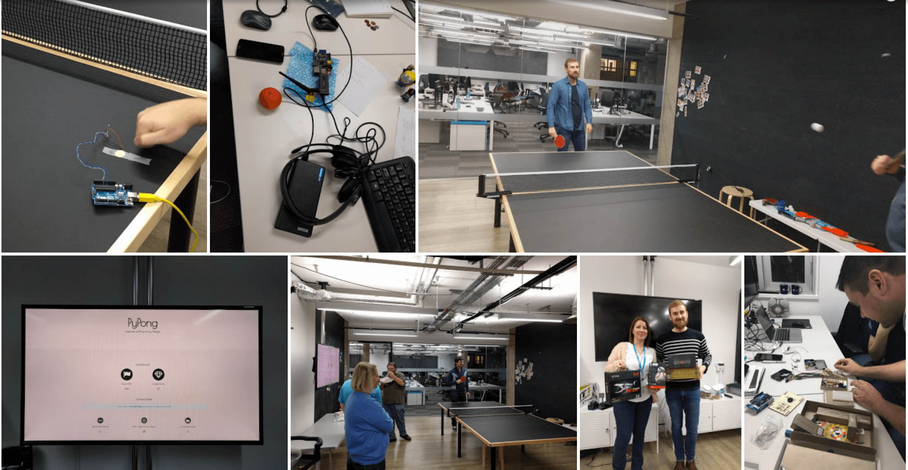

# PyPong
PyPong is an interactive teble tennis monitoring system. Once set up, PyPong monitors ping pong ball bounce frequency to measure game logevity, total number of bounces, and longest rally. The results are displayed on the dashboard, if the table currently is in use, the notification service allows user to recieve SMS message when the table becomes available.

## Set Up
* Orange RPi
* USB Headset (used for microphone, but only usb mic will do)
* 10,000 mAh power bank
* Wi-Fi dongle

## Installation
First, start MySQL server locally
```
virtualenv venv
source venv/bin/activate
pip install -r requirements.txt
export FLASK_APP=app
export FLASK_DEBUG=true
flask run
```

## Contributing
Your contributions are always welcome!


### Winner of Nexmo IoT Hackaton, 2016

